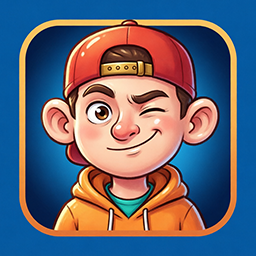

# Vovochka


**Vovochka** is a modern open-source reimplementation of the original game *Velikolepny Vovochka* (2002) by Macho Studio. All credits for the original game belong to the original authors.

### Technologies & tools

- [raylib](https://www.raylib.com/) — simple and easy-to-use library for game development (zlib license)
- [raylib-nx](https://github.com/luizpestana/raylib-nx) — Nintendo Switch port of the raylib by Luiz Pestana (zlib license)
- [devkitPro](https://devkitpro.org/) (devkitA64 + libnx) — Nintendo Switch homebrew toolchain
- [MinGW-w64](https://www.mingw-w64.org/) — Windows cross-compilation
- [nlohmann/json](https://github.com/nlohmann/json) — JSON for settings, game data and saves (MIT)
- [pl_mpeg](https://github.com/phoboslab/pl_mpeg) — lightweight MPEG-1 decoder for in-game video playback (MIT license).
- [FFmpeg](https://www.gyan.dev/ffmpeg/builds/) — A complete, cross-platform solution to record, convert and stream audio and video (GNU Lesser General Public License (LGPL) version 2.1)
- [Docker / devcontainer](https://www.docker.com/) — reproducible build environment
- [GNU Make](https://www.gnu.org) — build automation

## Resource Preparation

The game does not include original assets. You need to place the original archives `Data.dat` and `movi.dat` into the `gameassets/` folder, then run the data build script:

```bash
python tools/build_data.py
```

## Building

### Windows

```bash
make win
# run: ./build/win/vovochka.exe
```

### Nintendo Switch

```bash
make switch
# copy contents of build/switch/ to sdmc:/switch/vovochka/
```

## License

- **Port source code** (`source/`) is licensed under the [MIT License](LICENSE).
- **Original game** © 2002 Macho Studio.
- **This project** is a fan-made reimplementation made for educational purposes; all rights to the original intellectual property remain with the authors.